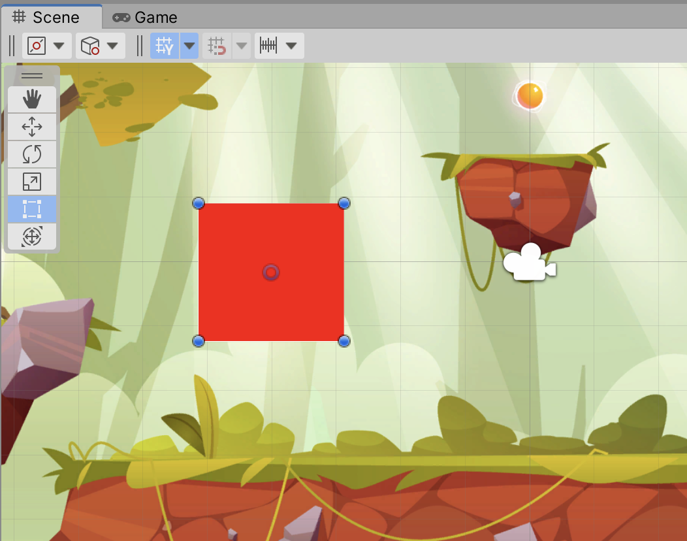
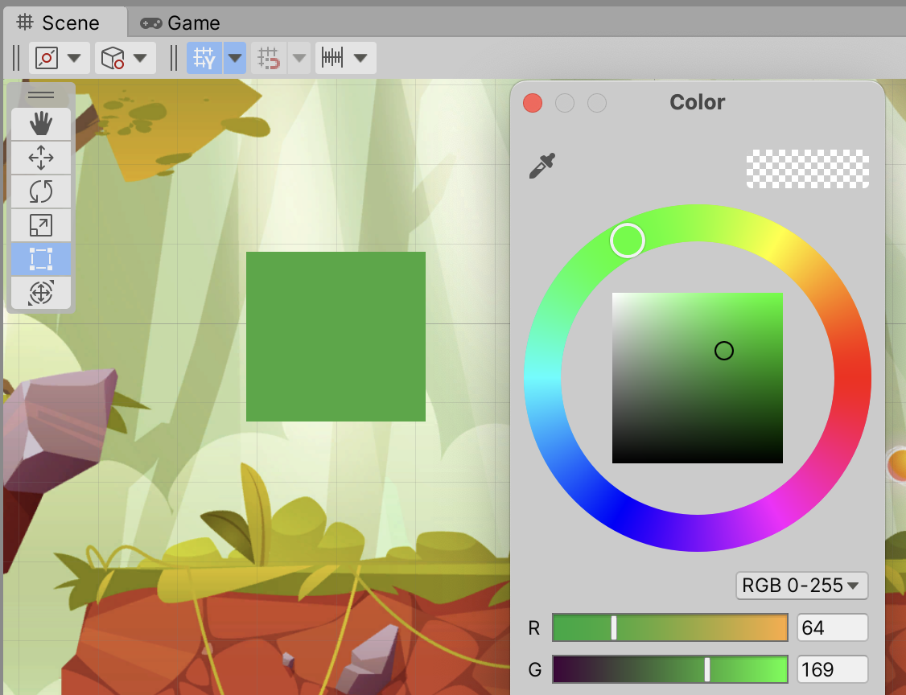

# unity-hlsl-shaders-2d

[HLSL (High Level Shader Language) shaders](https://docs.unity3d.com/Manual/SL-ShaderPrograms.html) examples for 2D Unity project.

HLSL shaders are written in code, and gives you a basic understanding of shader programming. It's also possible to use [Unity Shader Graph](https://docs.unity3d.com/Manual/shader-graph.html)

# Shader examples

## Create first simple solid shader

1. In Project window, right click and select `Create->Shaders->Unlit Shader`
1. Rename the created shader to e.g. `SolidShader`
1. Double-click to open the shader in your configured editor tool
1. For now we don't need `_MainTex` and fog related code in shader, so remove that.
1. Change code to following. Notice that we changed the name to `MyShaders/SolidShader` in first line
    ```
    Shader "MyShaders/SolidShader"
    {
        Properties
        {
        }
        SubShader
        {
            Tags { "RenderType"="Opaque" }
            LOD 100

            Pass
            {
                CGPROGRAM
                #pragma vertex vert
                #pragma fragment frag

                #include "UnityCG.cginc"

                struct appdata
                {
                    float4 vertex : POSITION;
                    float2 uv : TEXCOORD0;
                };

                struct v2f
                {
                    float2 uv : TEXCOORD0;
                    float4 vertex : SV_POSITION;
                };

                v2f vert (appdata v)
                {
                    v2f o;
                    o.vertex = UnityObjectToClipPos(v.vertex);
                    o.uv = v.uv;
                    return o;
                }

                fixed4 frag (v2f i) : SV_Target
                {
                    fixed4 col = fixed4(1, 0, 0, 1);
                    return col;
                }
                ENDCG
            }
        }
    }
    ```
1. The interesting part in the shader is the "fragment shader" (also called "pixel shader"), which is run for each pixel drawn on screen:
    ```
    fixed4 frag (v2f i) : SV_Target
    {
        fixed4 col = fixed4(1, 0, 0, 1);
        return col;
    }
    ```
   In this case, we simply return (draw) the color red for each pixel, since the `fixed4` arguments are Red, Green, Blue and Alpha (transparency).
1. Back in Unity, right-click your shader in the Project window and select `Create->Material` and name it e.g. `SolidMaterial`. This creates a new material, which uses the shader we just created.
1. In the scene Hierarchy window, e.g. create a `2D Object->Sprites->Square` and assign the `SolidMaterial` to it
1. If everything works, it should now look like this:
   

See [SolidShader.shader](Assets/Shaders/SolidShader/SolidShader.shader) for the shader code for this shader.

## SolidColorShader

1. Like the `SolidShader` in previous section, create a new `Shaders/SolidColorShader/SolidColorShader.shader`
1. It will be similar to the `SolidShader`, with a few changes
   - Define a `_Color` property for the shader, which will control which color we're drawing:
     ```
     Properties
     {
         _Color("Color: ", color) = (0,0,0,0)
     }
     And the fragment shader method returns the selected color:
     ```
     fixed4 _Color;
     fixed4 frag (v2f i) : SV_Target
     {
         fixed4 col = _Color;
         return col;
     }
     ```
1. Create a new material for the shader, and assign it to a game object.
1. It should now be possible to select a color when selecting the material in Unity:
   


# Links and credits

## Recommended videos:
* [Shader Fundamentals](https://www.youtube.com/playlist?list=PLq4ehwQIHfrUHo2UcxDAl_gcPLb2f3T2y)
* [Shaders Without Textures](https://www.youtube.com/playlist?list=PLq4ehwQIHfrW_KmCgKMRvdmQ-ieSZofNa)

## Credits:
* [Background image by upklyak](https://www.freepik.com/free-vector/game-platform-cartoon-forest-landscape-2d-ui-design-computer-mobile-bright-wood-with-green-trees-grass-lianas-background-with-arcade-elements-jumping-bonus-items-nature-locations_12345468.htm#query=platform%20game%20background&position=17&from_view=keyword)
